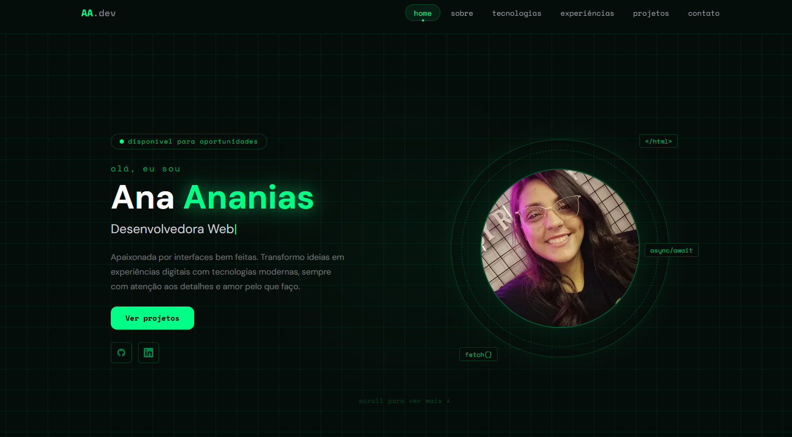

# Ana Ananias — Portfólio v2 💻


> Reconstrução completa do portfólio pessoal usando Next.js, TypeScript e React. Mesma temática hacker/terminal da versão anterior, agora com componentes reutilizáveis, animações com Motion e deploy na Vercel.

### ✨ [Veja o portfólio ao vivo aqui!](#)

---

### 📸 Screenshots

#### 💻 Desktop


---

### 📖 Sobre o Projeto

Segunda versão do portfólio pessoal, reconstruída do zero com tecnologias modernas. A decisão de migrar veio da vontade de aprender na prática — sair do JavaScript puro e entrar de cabeça em TypeScript, React e Next.js.

A identidade visual hacker foi mantida e aprimorada: fundo escuro, neon verde, efeitos de glitch e terminal. Mas agora tudo é componentizado, tipado e animado com Motion.

---

### 🚀 Tecnologias Utilizadas

- **TypeScript** — tipagem estática em todo o projeto
- **React** — componentização da interface
- **Next.js 14** — App Router, Server e Client Components
- **Tailwind CSS v4** — estilização utility-first
- **Motion** — animações com spring physics e layoutId
- **Supabase** — usado nos projetos listados no portfólio
- **Git + GitHub** — controle de versão
- **Vercel** — deploy contínuo

---

### 🎮 Seções e Funcionalidades

- **Hero** — apresentação com typewriter animado e foto de perfil
- **Sobre** — cards de trajetória com animações ao scroll
- **Tecnologias** — grade de skills com efeito glitch no hover (além disso temos também uma seção exclusiva com efeito de scan que "detecta" as ferramentas usadas nesse portfólio)
- **Experiências** — timeline de experiências profissionais
- **Projetos** — cards com GlitchText no hover e modal detalhado ao clicar
- **Contato** — animação de terminal hacker antes de revelar a seção, com copy de email

---

### 🧠 Aprendizados

- Migração de JavaScript puro para TypeScript com tipagem de componentes e props
- Componentização com React: separação de responsabilidades e reuso
- App Router do Next.js com uso correto de `"use client"` e Server Components
- Animações com Motion: `layoutId` para pill da navbar, `useInView` para reveal ao scroll, `AnimatePresence` para modais
- Tailwind CSS v4 com `@utility` e `@keyframes` no `globals.css` em vez de `tailwind.config.js`
- `IntersectionObserver` substituído por listener de scroll para detecção de seção ativa
- Scroll suave com offset da navbar fixa via `window.scrollTo`
- Efeito de scan com `requestAnimationFrame` + `getBoundingClientRect` para detectar cards
- GlitchText com pseudo-elementos CSS e variáveis CSS customizadas via `style` inline

---

### 🐛 Desafios e Soluções

- **`ProjectCard` sem corpo causava erros em cascata** — a função foi declarada sem `return`, o que fazia o TypeScript perder o contexto e jogar erros em todo o arquivo. Resolvido adicionando o `return` correto.
- **Detecção de seção ativa bugada na navbar** — o `IntersectionObserver` com `threshold` alto não funcionava bem em seções longas. Resolvido trocando por um listener de `scroll` que compara a posição de cada section com o offset da navbar.
- **Linha de scan não detectando cards corretamente** — a posição da linha era relativa ao grid mas a comparação usava coordenadas absolutas da tela. Resolvido usando `getBoundingClientRect` tanto para a linha quanto para os cards, normalizando no mesmo sistema de coordenadas.

---

### 🎨 Identidade Visual

A temática hacker voltou mais forte nessa versão. Manter a mesma personalidade visual enquanto reconstruía tudo com tecnologias novas foi o desafio mais interessante — garantir que a experiência ficasse igual ou melhor, mas agora com código de qualidade por baixo.

O efeito de scan na seção de tecnologias, o terminal animado no contato e o GlitchText nos projetos são os favoritos dessa versão.

---

### 👷 Como executar o projeto

1. Clone o repositório:
```bash
git clone https://github.com/anaflgg/ana-portfolio-v2.git
```

2. Instale as dependências:
```bash
npm install
```

3. Rode em desenvolvimento:
```bash
npm run dev
```

4. Acesse em `http://localhost:3000`

---

© 2026 Ana Ananias. Todos os direitos reservados.
